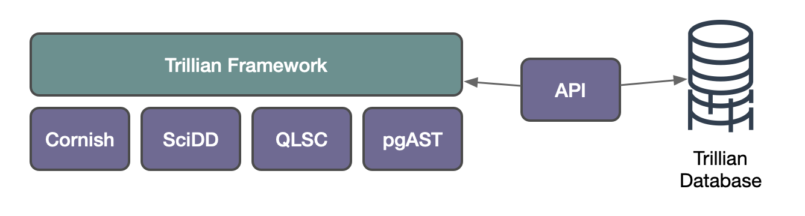

Trillian
========
#### An All-Sky, Multi-wavelength Astronomy Computational Engine

Trillian is an ambitious project created and developed by Demitri Muna whose aim is to bridge the gap between astrophysical models and the vast amount of publicly available astronomical data. One of its primary aims is to make the analysis of large volumes of multi-wavelength data as easy as analyzing a single image.

The aims are accomplished through a consolidated, curated database of metadata of numerous astronomical datasets. On top of this is an “astronomer language” toolkit and API that trivially scales from individual to all-sky investigations for all datasets indexed.

What problems do these solve?

* Dramatically simplified data access accelerates time-to-science by removing the overhead of trying to identify and understand the metadata of individual data sources
* By developing a user interface written in the domain language of researchers, time to science is further accelerated by being optimized to take advantage of the simplified data access.

##### *It’s always about the interface.*

#### Where Can I Read More About It?

* A more detailed description of the project can be found here: <http://trillianverse.org>.

* The initial white paper providing the motivations paper written by Demitri Muna and Eric Huff that describes Trillian in more detail can be found here:  [arXiv:1402.5932](http://arxiv.org/abs/1402.5932).

## Support

The [Center for Cosmology and Astroparticle Physics (CCAPP)](https://ccapp.osu.edu/) at Ohio State University awarded the project a $10K startup fund which was used to purchase a ~30TB server to develop a proof of concept. Ongoing hosting support is gratefully acknowledged from the CCAPP. Trillian's development has been partially (and indirectly) supported by a NASA Astrophysics Data Analysis Program (ADAP) grant.

## Project Status (Can I Use Trillian Yet?)

Soon! Trillian is under active development. It is currently being used by the author and collaborators at NASA's Jet Propulsion Laboratory to do all-sky, multi-wavelength analyses, and the first results paper is in preparation.

The project is comprised of several components written by Demitri Muna:

* [Cornish](https://github.com/demitri/cornish): A Python interface over the [Starlink AST](https://starlink.eao.hawaii.edu/starlink/AST) astronomical software library (part of the [Starlink Software Collection](https://starlink.eao.hawaii.edu/starlink/WelcomePage)). This library performs region handling on the sky.
* [Scientific Data Descriptors(SciDD)](https://github.com/scidd/scidd-core): A schema and Python library that provides a location-independent interface to data by defining unique descriptors that point to specific resources.
* [QLSC: Quadrilateralized Spherical Cube for Python](https://github.com/demitri/qlsc): A geospatial indexing scheme for segmenting a sphere into pixels with the aim of optimized spatial indexing and queries.
* [pgAST](https://github.com/demitri/pgast): A PostgreSQL plug-in that implements some functionality from [Starlink AST](https://starlink.eao.hawaii.edu/starlink/AST), a library for handling world coordinate systems (WCS) in astronomy, providing an interface between WCS and region-related functionality for databases containing astronomical data.

All of these components can be accessed via the links above.

The Trillian Python framework and API have not yet been made available to the public. The only thing that remains for release is the completion of the documentation, tutorials, examples that will describe the framework and how to use it in detail. This is in progress and expected to be released soon.

*The code will be made publicly available once the documentation is written.*

An additional component of the framework is the functionality to run all-sky, multi-wavelength distributed analyses. While working in development, it will require further development time to be ready for public consumption.

## What Is Trillian?

Trillian is a project to create a next-generation astronomical archive, allowing astronomers to analyze hundreds of terabytes of data (or more!) as easily as they would dozens of files on their own hard drive.

#### The Problem.

Astronomy has generated *a lot* of freely available, public data. For example, the [Pan-STARRS data release](http://panstarrs.stsci.edu) alone is 2PB in size, and that's just one telescope. Astronomical data are available through a number of archives around the world such as the [Space Telescope Science Institute](http://archive.stsci.edu),  [IPAC](http://ipac.caltech.edu), or [SDSS](https://data.sdss.org). There is no single, central repository of data. These archives are organized by the funding bodies for the telescopes or satellites, e.g. NASA or hosted by the individual surveys. Typically, this means that optical data will be in one archive, radio in another, infrared yet another, etc. This makes sense from an organizational of funding point of view, but it makes life difficult for the individual astronomer.

When an astronomer wants to study a particular set of objects, ideally she wants to get all of the observations that have been made of those objects. First, she must identify the archives that might contain data for those objects. Next, she will go to each of those archives and, most frequently, enter the positions in the sky she wants manually into a web form (where each web form is different) and download the files herself. Extracting the data from the files is another task – while all of the files will likely be in the [FITS format](https://github.com/trillian/trillian/wiki/What-is-a-FITS-file%3F), the data from each telescope or satellite will be organized differently. Finally, she will be able to use her code to analyze the data.

This manual process doesn’t scale to large data sets. The individual astronomer has limited time to visit all of the archives (assuming she is aware of all of them) so she uses the ones she's most familiar with, potentially leaving data on the table. She may be able to download data for hundreds or even thousands of objects, but not millions from several archives. She has limited disk space to download data (so, for that matter, does her department or whole university!). It's impossible to perform an analysis across many different observed wavelengths across the whole sky.

#### The Solution.

Trillian is a framework that aims to solve these problems. First, it is an archive that will organize astronomical data by position on the sky, not by wavelength. Even if you can programmatically access all of the data needed remotely, you will spend more of your time waiting to download it.

If we can't bring the data to the astronomer’s code, let's bring the code to the data. By customizing a provided Python module template, the user can write their own, custom module to analyze data. Is radio data available? Let's use it. Are distance measurements available? Use them. The Trillian framework will supply the data available from any data set that has been indexed. The custom code is then placed into a Docker container and send to a server where the data is on disk. The data is analyzed, where the results stored in a database and made available to the user.

This is the only model of data analysis that can currently enable individuals with limited resources to analyze hundreds of terabytes (or even petabytes) of data. It will allow us to ask scientific questions of data – that is currently sitting on disk! – that we lack the tools to ask.

## Mozilla ScienceLab

The [Trillian project](https://science.mozilla.org/projects/trillian) was selected as one of the earliest open source projects of Mozilla Science Lab’s [Collaborate on Software for Science](http://collaborate.mozillascience.org). The recognition of our project and its aims was flattering and very appreciated. The process and inclusion was very instructive for myself (and, I hope, the Science Lab as well). It provided a great platform to bring people from the general community into a project like this. There were several "lessons learned" for me. First, it's probably best for a project to be at a certain stage of development before people not familiar with the domain (here, handling astrophysical data) can be brought in. A project like this starts with basic architecture — think the foundation of a house. Building this requires deep knowledge of not only the specific problems to be solved but of the eventual usage, each of which require domain knowledge. From my experience and observation, this stage of development is often done by a very small number of people with a shared vision. Once the foundation is laid, it's possible to divide work into small enough units that people without the specific domain knowledge can "swoop in" to help. Another lesson learned is that with open source projects, volunteers can have wildly varying skill sets or backgrounds. Integrating these into a project is possible, but also requires time and attention. This is understandable, but the very nature of volunteered effort means that help can disappear as quickly as it can appear. This is not to challenge the effectiveness of the model, but note only that it is a challenge.

All said, I got a lot out of being a participant of the Mozilla Science Lab and would be happy to continue to support and participate.

## Contact

The Trillian project is currently seeking collaborators. If you are interested in contributing to this project, please contact [Demitri Muna](http://github.com/demitri) at `demitri.muna` at `utsa` dot `edu`.

